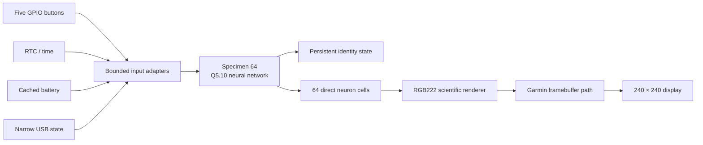

<div align="center">

# FLYWATCH / SPECIMEN 64

```text
                 \   |   /
              .---\--+--/---.
           .-'    o--o--o     '-.
         .'   o--o  / \  o--o    '.
        /   o/  o--o---o--o  \o    \
       ;   / o--o  FLY  o--o \     ;
       |  o--o  NEURAL FIELD  o--o  |
       ;   \ o--o  64  o--o  /     ;
        \   o\  o--o--o  /o       /
         '.   o--o  |  o--o      .'
           '-.____\_|_/_____.-'
                  /   \

           FORERUNNER 245 // ALIVE
```

**A fruit-fly-inspired neural organism living inside a Garmin Forerunner 245.**

`64 NEURONS` · `FIXED-POINT` · `PERSISTENT STATE` · `240 × 240` · `VERY EXPERIMENTAL`

</div>

---

## What is this?

FlyWatch is an attempt to turn a Garmin Forerunner 245 into a strange little
scientific instrument—part watch face, part neural observatory, part persistent
artificial organism.

The watch currently runs **Specimen 64**, a deterministic 64-neuron network with
sparse weighted connections. Every simulated neuron maps directly to a cell in
the display. The colors and pulses are state, not decorative random noise.

This is firmware reverse engineering, not a Connect IQ app.

> [!IMPORTANT]
> The current result is a **GarminOS-resident executable overlay**. It is not yet
> a replacement bootloader or standalone operating system. Arbitrary boot has not
> been demonstrated, and recovery still depends on GarminOS and USB continuing to work.

## Specimen status

| Channel | Reading |
|---|---|
| Host organism | Garmin Forerunner 245, non-Music, HWID 3076 |
| Installed experiment | Synthetic 13.74 wrapper over official 13.70 application |
| Neural population | 64 deterministic fixed-point neurons |
| Neuron-to-screen mapping | 1 simulated neuron → 1 rendered cell |
| Live inputs | Five buttons, RTC, cached battery percentage, narrow USB state |
| Unbound inputs | Heart rate, motion, ambient light, charging telemetry |
| Persistence | Designed and host-tested; live identity persistence is still limited |
| Boot independence | Not demonstrated |
| Feasibility verdict | **YELLOW — alive inside GarminOS, not free of it** |

## The current instrument

```text
┌──────────────────────────────┐
│ 14:52              B 73%     │
│                              │
│       /\  SPECIMEN  /\       │
│      /  \    64    /  \      │
│     │ ·─●─·──●──·─● │        │
│     │ ●╲·╱●  ·  ●╲· │        │
│     │ ·─●──●──●─·   │        │
│     │ ●╱·╲●  ·  ●╱· │        │
│      \__NEURAL FIELD_/       │
│                              │
│ STATE  QUIET / RESPONSIVE    │
│ AGE    03:14:22              │
└──────────────────────────────┘
```

The live display uses the watch's RGB222 framebuffer palette:

- **Green** — excitatory activity
- **Magenta** — inhibitory activity
- **Amber** — saturated activity
- **Gray** — anatomical scaffold
- **Black** — background

The interface deliberately looks like a lab readout rather than a cartoon
smartwatch. The display renderer and network model are reproducible on the host
before they are compiled into the constrained target overlay.

## The next controls build

The installed 13.74 experiment still lets some Garmin key subscribers navigate
away from the neural face. A synthetic 13.76 successor is now built and verified
offline, but has not been staged on hardware. It intercepts controlled keys
before Garmin's shared publisher and keeps an explicit system escape.

| Physical control | Instrument label | Intended neural effect | Ownership policy |
|---|---|---|---|
| Top-left | `LIGHT>LUX` | Light stimulus placeholder | Passes to Garmin so the backlight remains available |
| Middle-left | `UP>PULSE` | Raise arousal | Captured only on the stable FlyOS home view |
| Bottom-left | `DOWN>CALM` | Lower arousal | Captured only on the stable FlyOS home view |
| Top-right | `START>BURST` | Inject a strong neural burst | Captured on FlyOS; native on system/update views |
| Bottom-right | `BACK>SYSTEM` | System escape | Always passes to GarminOS |

The 13.76 design latches FlyOS ownership for a complete press sequence, requests
an immediate redraw through Garmin's nonblocking UI queue, and retains short taps
for one visible frame. Holding BACK while pressing another key forces that key
to Garmin. Every non-home, malformed, USB-update, charging, notification, or
menu view also retains native controls.

## Signal path



No floating point is required in the target neural step. The model is small,
sparse, deterministic, and designed to evolve continuously on watch-scale power
and memory budgets.

## What lives in this repository

```text
flyos/
├── fly/          neural models and persistence
├── display/      framebuffer and neural renderers
├── input/        host input adapters
├── kernel/       host runtime
├── target/       Cortex-M4 and FR245 overlay targets
└── tests/        deterministic model and renderer tests

tools/
├── garmin-firmware/   GCD inspection, emulation, validation, and packaging
├── device-backup/     read-only backup tooling
└── live-proof/        guarded update staging

docs/                  hardware, firmware, boot, recovery, and experiment evidence
```

Private watch files, activity and GPS history, unique identifiers, official Garmin
firmware, modified update images, Ghidra databases, and generated target binaries
are intentionally excluded from Git.

## Build the organism on a host

```powershell
cmake -S flyos -B flyos/build
cmake --build flyos/build
ctest --test-dir flyos/build --output-on-failure
```

The host suite exercises the neural model, persistence format, display renderer,
color roles, preview export, and deterministic behavior. Target builds require a
local ARM toolchain plus byte-pinned firmware evidence that is not distributed here.

## Evolution log

- [x] Inventory the FR245 USB and firmware surface
- [x] Preserve and hash all locally accessible evidence
- [x] Parse Garmin GCD update containers reproducibly
- [x] Demonstrate visible modified resources on the live watch
- [x] Execute bounded custom ARM code inside the Garmin application
- [x] Render a full-screen interactive neural display
- [x] Expand from 32 to 64 directly mapped neurons
- [x] Verify guarded home-view button ownership offline
- [x] Make every neural button effect visible and legible offline
- [ ] Confirm the guarded controls build on hardware
- [ ] Bind safe heart-rate, motion, and charging observations
- [ ] Strengthen persistent identity across restarts
- [ ] Establish a dependable nonboot recovery path
- [ ] Demonstrate standalone custom boot—or document why it is impractical

## Evidence before mythology

This project does not claim secure-boot bypass, arbitrary firmware execution, or
standalone FlyOS without evidence. The current boundary is documented in the
[session report](docs/session-report.md), [boot-chain analysis](docs/boot-chain.md),
[N64 design](docs/superpowers/specs/2026-09-14-flyos-neural-specimen-n64-design.md),
and [recovery analysis](docs/recovery.md).

Firmware experiments can permanently brick the watch. Review the exact image,
write ranges, recovery assumptions, and hashes before staging anything to hardware.
The guarded staging tool defaults to a dry run and does not include firmware images.

---

<div align="center">

`FLY LIVES // OBSERVE CAREFULLY`

Garmin and Forerunner are trademarks of Garmin Ltd. This project is unaffiliated
with and unsupported by Garmin.

</div>
