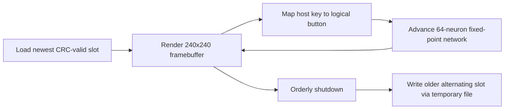

# FlyOS Host Proof-of-Concept Architecture

## Scope

The current FlyOS code is a host-only behavioral prototype. It demonstrates a deterministic
small neural simulation, limited-palette 240×240 rendering, logical five-button input, and
recoverable persistent state. It is **not** a loadable Garmin image and contains no claimed
working Forerunner drivers.

## Repository layout

```text
flyos/
  boot/       target startup contract; no guessed K28F startup code
  drivers/    explicit unimplemented display/button/power/storage target calls
  display/    240×240 indexed framebuffer and PPM host output
  input/      host keyboard to logical-button mapping
  kernel/     interactive host event loop
  fly/        fixed-point network and versioned persistence
  tools/      host tooling notes
  tests/      deterministic behavior and recovery tests
```

## Runtime model

The host loop loads the newest valid state slot or creates an identity from a fixed seed. It
renders a scientific-instrument face, accepts one logical button event, advances the network,
and writes `flyos-screen.ppm`. State is saved at orderly shutdown.



The eventual target should use a cooperative tick/event loop. Display refresh, neural steps,
input debounce, sensor polling, and persistence scheduling can remain independent modules.
No preemptive scheduler is needed for the initial system.

## Neural simulation

`FlyNetwork` contains 64 signed Q8.8 neuron activations, a deterministic xorshift PRNG state,
a tick counter, and one homeostatic mood variable. Each neuron receives a leaky self term and
three fixed sparse directed inputs. The first five neurons receive logical button stimuli;
neurons 48–55 receive a homeostatic term; neurons 56–63 feed the mood update.

This topology is an engineering motif rather than a claimed Drosophila connectome. The next
offline revision can replace it with explicit populations inspired by primary evidence:

- central-complex ring/heading circuits, where bump-like population activity represents
  heading;^1
- mushroom-body sparse association and reinforcement, using compartmentalized Kenyon-cell,
  dopaminergic, and output-neuron roles;^2
- sensory projection neurons;
- descending/motor action selection, reflecting central-complex pathways from multimodal
  context to descending neurons;^3
- a slow recurrent state variable inspired by experimentally observed persistent internal
  states in small Drosophila circuits.^4

All state evolution uses integers. The current network uses approximately 140 bytes plus
temporary stack storage for one previous-activation vector. Its topology is computed from
indices, so it consumes no edge table. A future learned sparse graph can store each edge as
two neuron indices and a fixed-point weight.

Determinism serves three purposes: reproducible tests, exact persistence validation, and
repeatable offline comparison between host and eventual target builds. Evolution comes from
recurrent activation, input timing, and the persisted PRNG state.

## Persistent identity

`FlyPersistentState` records:

- identity seed;
- birth time and accumulated age;
- sequence number;
- complete neural and PRNG state;
- lifecycle policy;
- reserved bytes for compatible schema evolution.

The host backend uses two alternating records, `<base>.a` and `<base>.b`. Each record has a
magic value, schema version, payload length, CRC-32, and commit marker. A save writes a
temporary file and then renames it over the older/invalid slot. Loading validates both slots
and chooses the highest valid sequence; if the newest record is corrupt, it falls back to the
older valid record.

The host record currently uses the compiler's native little-endian C structure layout. A
target format must encode fields byte-by-byte with fixed offsets before it can be considered
portable across toolchains or schema versions.

This models power-loss tolerance but does not yet model K28F flash constraints. Target design
must use an identified non-critical storage region, account for actual erase-block and page
sizes, and rate-limit writes. A reasonable starting policy is a checkpoint every 10–30
minutes plus important state transitions, with an in-RAM dirty flag and wear-level journal.

The lifecycle policy currently defaults to `CONTINUE`. The schema reserves
`NEW_IDENTITY_AFTER_POWER_LOSS`, but no irreversible death behavior is implemented. True
battery-dead detection also remains undefined because orderly shutdown, brownout, watchdog
reset, and battery removal must be distinguished using verified PMIC/reset-cause data.

## Display

The framebuffer is 240×240 with four prototype palette indices:

| Index | Role |
|---:|---|
| 0 | black field |
| 1 | dim specimen lines and labels |
| 2 | neural activity |
| 3 | primary text |

One byte per pixel uses 57,600 bytes. This favors simple host verification and fits well
within the K28F's documented 1 MiB SRAM. A target backend can later pack pixels or convert to
the panel's native format after that format is recovered.

The face renders time, an abstract specimen silhouette with sparse internal activity,
`STATE`, `AGE`, and the required `FLY LIVES` text. A dependency-free PPM writer makes every
frame inspectable without a GUI library.

`display/garmin_row_packer.c` also contains the verified RAM-only conversion
from one 240-byte logical row to the official firmware's 244-byte staging-row
layout. Its pair packing, framing bytes, and reverse transform are tested from
hand-derived vectors and separately checked against the preserved 3.10 and
13.70 Thumb routines by `tools/garmin-firmware/display_row_model.py`. The
module has no peripheral-register access and must not be treated as a panel
driver.

## Input

The host mappings are:

| Key | Logical control |
|---|---|
| `w` | UP |
| `s` | DOWN |
| `a` | BACK |
| `d` | START/SELECT |
| `q` | LIGHT |
| `x` | exit host prototype |

Logical input is deliberately separate from GPIO. A target driver will need verified pins,
active levels, pull configuration, debounce time, long-press behavior, and wake sources.

## Hardware boundary

`drivers/hardware_stub.c` returns `FLYOS_HW_UNIMPLEMENTED` for display, buttons, power, and
storage. Static analysis now identifies the five button GPIO pins and the display's
FLEXIO0/DMA engine, PTE pin set, 57,600-byte logical framebuffer, dirty rectangles, and
244-byte staging stride. The target skeleton does not activate them because the button
levels/pulls, FLEXIO timing, row framing, signal roles, watchdog policy, clock tree, and power
sequence are still incomplete.

## Freestanding K28 structural build

`flyos/target/k28/` builds a Cortex-M4 ELF and flat binary with Arm GNU Toolchain
15.2.Rel1. It links at `0x3000`; a 124-entry, `0x1f0`-byte vector table places
`Reset_Handler` at `0x31f0`, producing reset vector `0x31f1`, matching both official
non-Music images. The current binary initializes C memory, evolves the 64-neuron network,
and renders `FLY LIVES` into a volatile 57,600-byte RAM framebuffer.

The framebuffer size now independently matches the official 3.10 and 13.70 display buffers
exactly (`0xe100` bytes). Its palette indices are still a FlyOS host convention; the recovered
firmware converter has not yet established the panel's exact bit-to-color mapping.

This is a structural proof only. The build manifest explicitly marks it non-installable and
lists the missing clock, watchdog, power, display, button, storage, and Garmin update-wrapper
components. A logical framebuffer in SRAM cannot make the physical panel change.

## Build and run

```powershell
cmake -S flyos -B flyos/build
cmake --build flyos/build
ctest --test-dir flyos/build --output-on-failure
flyos/build/flyos-host.exe

powershell -ExecutionPolicy Bypass -File flyos/target/k28/build.ps1
```

The interactive program writes `flyos-screen.ppm` and, on exit, alternating files named
`flyos-state.a` and `flyos-state.b` in its working directory. These files are host artifacts
only.

## Verification coverage

The host tests establish:

1. identical seed and input streams yield byte-identical network state;
2. activity evolves over 200 integer-only steps;
3. corruption of the newest persistence slot causes fallback to the prior valid state;
4. status rendering produces primary text pixels in the `FLY LIVES` region;
5. all five keyboard controls map to distinct logical button bits.

The target build also rejects undefined symbols and asserts the observed flash origin,
`0x1f0` vector-table size, initial stack, and `0x31f1` reset vector. These checks say nothing
about Garmin update acceptance, target boot, display communication, or GPIO control.

## Biological design sources

1. Seelig and Jayaraman, “[Ring attractor dynamics in the Drosophila central brain](https://pubmed.ncbi.nlm.nih.gov/28473639/),” *Science*, 2017.
2. Aso et al., “[The neuronal architecture of the mushroom body provides a logic for associative learning](https://elifesciences.org/articles/04577),” *eLife*, 2014.
3. Hulse et al., “[A connectome of the Drosophila central complex reveals network motifs suitable for flexible navigation and context-dependent action selection](https://pmc.ncbi.nlm.nih.gov/articles/PMC9477501/),” *eLife*, 2021.
4. Hoopfer et al., “[P1 interneurons promote a persistent internal state that enhances inter-male aggression in Drosophila](https://pmc.ncbi.nlm.nih.gov/articles/PMC4749567/),” *eLife*, 2015.
